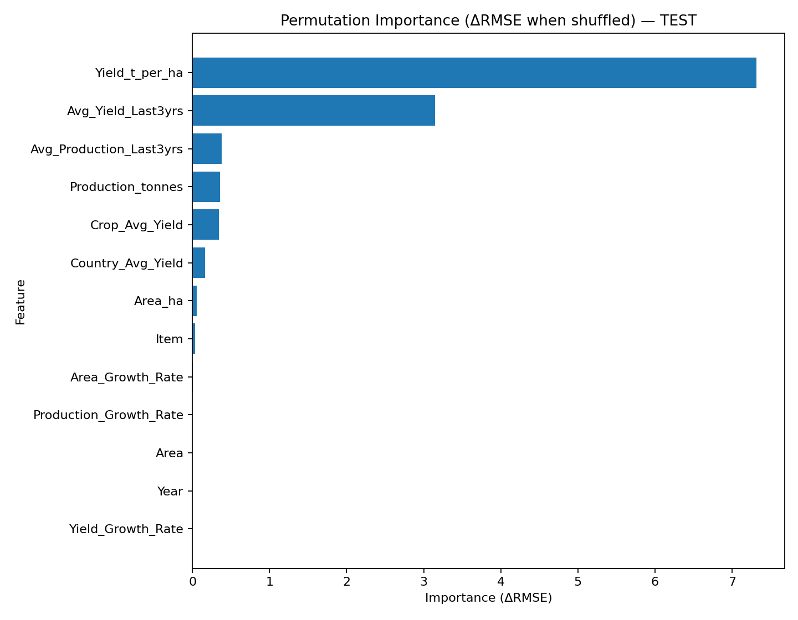
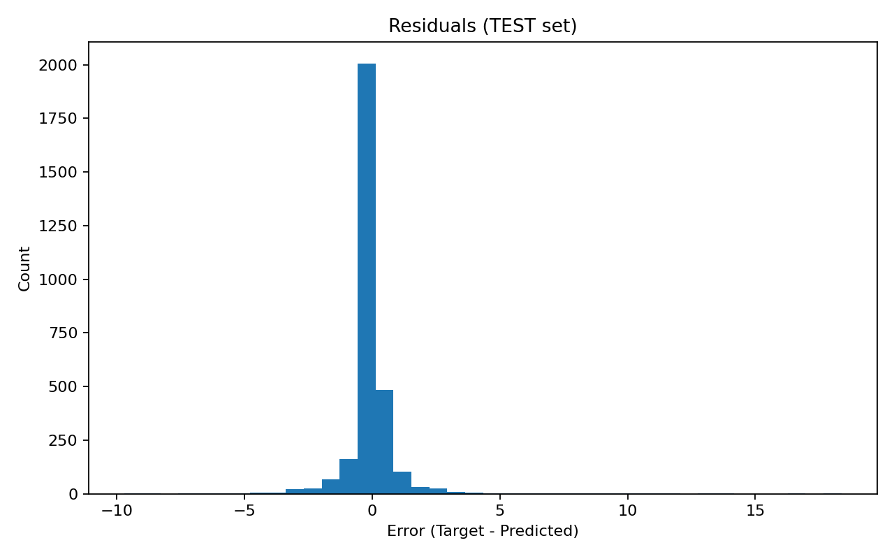

# Agri-Fin Capstone — Model Report

_Generated: 2025-10-20 12:39_

## Overview

- Task: Predict **next-year yield (t/ha)** per (Country, Crop, Year).
- Best model (by VALID RMSE): **Linear Regression** (saved pipeline).

## Metrics (RMSE / MAE / R²)

**RMSE**

| split   |   LinearRegression |   RandomForest |
|:--------|-------------------:|---------------:|
| test    |            1.2308  |       1.26911  |
| train   |            1.36312 |       0.783763 |
| valid   |            1.17385 |       1.19423  |

**MAE**

| split   |   LinearRegression |   RandomForest |
|:--------|-------------------:|---------------:|
| test    |           0.497958 |       0.482127 |
| train   |           0.570081 |       0.300584 |
| valid   |           0.512102 |       0.492904 |

**R²**

| split   |   LinearRegression |   RandomForest |
|:--------|-------------------:|---------------:|
| test    |           0.974221 |       0.972591 |
| train   |           0.968221 |       0.989494 |
| valid   |           0.976679 |       0.975862 |

## Feature Importance (Permutation, ΔRMSE)

Top-20 features by how much RMSE worsens when shuffled.

## Residuals (Test Set)

Should be roughly centered around 0.

## Top 20 Largest Errors (Test)

See CSV for details: `top20_misses_test.csv`.

## Error by Country & Crop (Test)

See CSV for details: `group_error_test.csv`.

## Data & Features

- Source: `Cleaned_AgriYield_Asia_2013_2023.csv`
- Engineered features: growth rates, rolling 3-year means, country/crop baselines.

## Repro Steps

1) Step 5: Feature engineering → `Processed_AgriYield_Features.csv`
2) Step 6: Train models → saves pipeline + predictions + metrics
3) Step 7: Evaluate → saves artifacts
4) Step 8: Importance → saves permutation importance
5) Step 9: Build this report